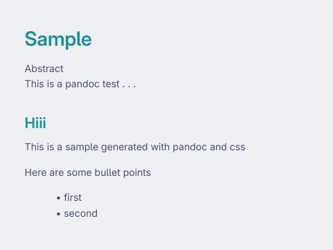

# Md2PDF

Template for creating beautiful PDFs, html from markdown using pandoc and css

## Dependencies
```
pandoc python-weasyprint
```
## Usage

```
pandoc -t html --css <path to style.css> <path to markdown file> -o <output_format>
```

example

```
pandoc -t html --css ./style.css ./sample.md -o sample.pdf
```

or

install [Just](https://just.systems/) and run the following in the project directory
```
just md2pdf ./sample.md ./style.css
```
in case you don't provide a style.css default style.css is used (located as style.css in the project root dir)
# Preview

### MD file

```
## Hiii

This is a sample generated with pandoc and css

Here are some bullet points

- first
- second

```

## Image


## Misc YAML declarations

```
---
title: Sample
header: wow...
abstract: This is a pandoc test . . .
---
## Hiii

This is a sample generated with pandoc and css

Here are some bullet points

- first
- second

```


